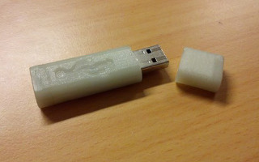

This repository contains a 3D model for a case for the Transcend JetFlash JF150
USB flash drive.

Instructions
------

After cloning this repo, you can simply use `transcend-jetflash-jf150-case.stl`
and `transcend-jetflash-jf150-lid.stl`. The case and lid are designed to hold
the PCB and the USB plug by friction, you may need to remove some material after
printing in order for the models to fit correctly.

If you want to use the OpenSCAD sources, you have to init and update the Git
submodules first:

 * `git submodule init && git submodule update`

This fetches all needed dependencies:

 * @Obijuan/obiscad, used for beveling edges

The case itself resides in `transcend-jetflash-jf150.scad`, which contains
several modules, the most important being `lid()` and `case()`. At the end of
the file, you can simply remove the comment for those modules you want to build.

Licence
-------

This thing is licenced under CC-BY-SA 3.0 Unported. For a full list of the
licensing terms, see [https://creativecommons.org/licenses/by-sa/3.0/deed](https://creativecommons.org/licenses/by-sa/3.0/deed).

This work contains the USB icon, which may be subject to trademark laws in one
or more jurisdictions. Before using this content, please ensure that you have
the right to use it under the laws which apply in the circumstances of your
intended use. You are solely responsible for ensuring that you do not infringe
the rights to this trademark. The use of this icon in the context of this
repository does not imply endorsement of the trademark holder by the author,
nor vice versa.

// vim: set et ts=2 sw=2 tw=0:
